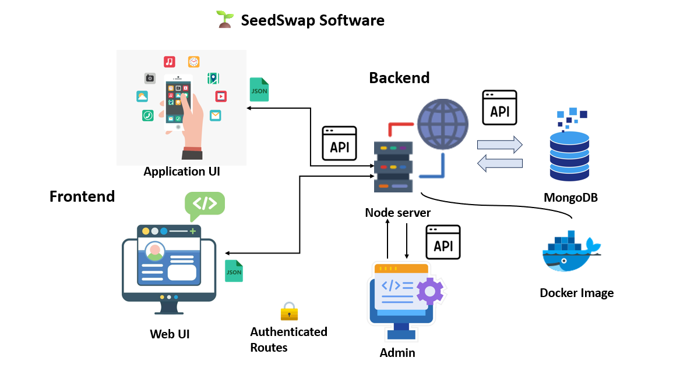

# 🌱 SeedSwap API

A community-based native seed exchange platform backend API.



## 📋 Features

- 🔐 User Authentication (JWT)
- 🌿 Seed Management
- 🤝 Seed Swapping System
- 💬 Real-time Chat
- 📧 Email Notifications
- 🖼️ Image Upload (Cloudinary)
- 📊 User Dashboard
- 🏪 Public Marketplace

## 🛠️ Tech Stack

- Node.js & Express
- MongoDB & Mongoose
- Socket.IO
- JWT Authentication
- Nodemailer
- Cloudinary
- Swagger UI

## 🚀 Getting Started

1. Clone the repository:

```bash
git clone <repository-url>
cd Backend
```

2. Install dependencies:

```bash
npm install
```

3. Create a `.env` file:

```env
PORT=5000
MONGO_URI=your_mongodb_uri
JWT_SECRET=your_jwt_secret
EMAIL_USER=your_gmail
EMAIL_PASS=your_app_password
CLOUDINARY_CLOUD_NAME=your_cloud_name
CLOUDINARY_API_KEY=your_api_key
CLOUDINARY_API_SECRET=your_api_secret
```

4. Start the server:

```bash
npm run dev
```

## 📚 API Documentation

Access the API documentation at: `http://localhost:5000/api-docs`

## 🔌 API Endpoints

### Auth

- POST `/api/auth/register` - Register user
- POST `/api/auth/login` - Login user
- GET `/api/auth/me` - Get current user

### Seeds

- POST `/api/seeds` - Create seed
- GET `/api/seeds` - Get all seeds
- PUT `/api/seeds/:id` - Update seed
- DELETE `/api/seeds/:id` - Delete seed

### Swaps

- POST `/api/swaps` - Create swap request
- GET `/api/swaps/me` - Get user's swaps
- PUT `/api/swaps/:id/accept` - Accept swap
- PUT `/api/swaps/:id/reject` - Reject swap
- PUT `/api/swaps/:id/complete` - Complete swap

### Marketplace

- GET `/api/marketplace` - Get public seeds

### Messages

- GET `/api/messages/:swapId` - Get chat history
- Real-time messaging via Socket.IO

### User

- GET `/api/user/me` - Get profile
- PUT `/api/user/me` - Update profile
- GET `/api/user/dashboard` - Get statistics

## 🔒 Environment Variables

- `PORT` - Server port (default: 5000)
- `MONGO_URI` - MongoDB connection string
- `JWT_SECRET` - JWT signing secret
- `EMAIL_USER` - Gmail address
- `EMAIL_PASS` - Gmail app password
- `CLOUDINARY_*` - Cloudinary credentials

---
